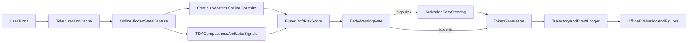

# DriftGuard Inference-Time Drift Plan

## Objective

Deliver a publication-ready preprint and matching codebase for real-time hidden-state drift detection + causal intervention in fixed deployed LLMs (starting with 8B/9B-class), focusing on multi-turn jailbreak/deception drift and topological manifold change.

## Scope-Locked Deliverables

- **Paper package**: structured manuscript (`intro`, `related work`, `method`, `experiments`, `results`, `limitations`, `appendix code outlines`) with KaTeX-ready equations and figure specs.
- **Runtime pipeline**: online trajectory capture, continuity + compactness/TDA drift scores, early-warning alarms, and intervention hooks.
- **Reproducible experiments**: local-fast configs for M4 Max + scale-up configs for 4x RTX6000.
- **Aggressive repo refactor**: remove/disable modules not serving inference-time drift + steering mission.

## Current Codebase Baseline (what we will leverage)

- Extraction + hidden states: `[/Users/alexlyu/Projects/llm-latent-drift/src/latent_dynamics/activations.py](/Users/alexlyu/Projects/llm-latent-drift/src/latent_dynamics/activations.py)`
- Model loading/device handling: `[/Users/alexlyu/Projects/llm-latent-drift/src/latent_dynamics/models.py](/Users/alexlyu/Projects/llm-latent-drift/src/latent_dynamics/models.py)`
- Existing drift scaffolding: `[/Users/alexlyu/Projects/llm-latent-drift/src/latent_dynamics/drift.py](/Users/alexlyu/Projects/llm-latent-drift/src/latent_dynamics/drift.py)`
- CLI entrypoint for pipelines: `[/Users/alexlyu/Projects/llm-latent-drift/src/latent_dynamics/cli.py](/Users/alexlyu/Projects/llm-latent-drift/src/latent_dynamics/cli.py)`

## Proposed Architecture

## Implementation Phases

### Phase 1 — Literature + Formalization (paper-first)

- Produce `Related Work + Gap Analysis` around DeepContext (2602.16935), Bullwinkel et al. (2507.02956), and PH/TDA adversarial-latent work; add 8–12 total core citations.
- Formalize trajectory and manifold metrics with consistent notation:
  - continuity: $\cos(\theta_t)=\frac{\mathbf{h}*t\cdot\mathbf{h}*{t-1}}{\lVert\mathbf{h}*t\rVert\lVert\mathbf{h}*{t-1}\rVert}$
  - local Lipschitz proxies on token-step transitions
  - compactness/topology: cloud diameter, $\beta_k$, persistence summaries, lobe-emergence signals.
- Define alarm decision rule and causal intervention objective.

### Phase 2 — Aggressive Codebase Re-focus

- Prune or archive modules that are off-mission for inference-time drift/steering (highest candidates: `/src/latent_dynamics/dayang/`, selected legacy experiment tracks).
- Collapse CLI surface to mission-critical commands:
  - `collect-online-trajectories`
  - `compute-drift-online`
  - `run-early-warning`
  - `run-steering-eval`
  - `build-paper-artifacts`
- Preserve minimal compatibility wrappers where easy, but prefer explicit breaking cleanup for clarity.

### Phase 3 — Online Telemetry + Drift Core

- Add token-step online capture loop (not only post-hoc batch extraction) in a new runtime module, reusing tokenizer/model loaders from existing core.
- Implement continuity metrics and rolling alarms.
- Add TDA path using reduced-dimensional point clouds (PCA layer-wise) with practical runtime controls (windowed PH, cadence throttling).
- Introduce drift fusion score + threshold calibration on benign/unsafe validation traces.

### Phase 4 — Causal Intervention (Path Steering)

- Implement activation-editing interventions (projection-to-safe-subspace and additive steering vectors) with clear “detect-then-intervene” causal protocol.
- Add ablation ladder:
  - detect only
  - intervene only
  - detect + intervene
  - no defense baseline.
- Track safety win vs utility cost (refusal overfire, helpfulness degradation, latency overhead).

### Phase 5 — Experiments + Figures

- Model set: Llama-3.1-8B, Gemma-2/3 9B-ish equivalent available locally, Mistral-7B class where practical.
- Threats: Crescendo-like multi-turn jailbreak trajectories, deception/sycophancy prompt chains, controlled quantization and domain shifts.
- Core visual set:
  - PCA trajectory maps (safe-to-unsafe drift paths)
  - persistence diagrams / barcode deltas across turns
  - cosine-drift and fused-risk heatmaps over token-time
  - lead-time vs unsafe-event curves.

### Phase 6 — Manuscript Finalization + Reproducibility

- Generate publication-ready tables/figures and reproducibility checklist.
- Add appendix code outlines for hook/capture, metric computation, and steering routines (nnsight/TransformerLens-compatible sketches plus native HF path).
- Include limitations: TDA scaling, threshold transfer, intervention side effects, model-family portability.

## Hardware-Aware Execution Strategy

- **Local M4 Max (128GB unified memory)**: default development path for 7B/8B/9B BF16 and short/medium context pilots.
- **Remote 4x Quadro RTX 6000**: sweep jobs for larger turn-depth experiments, PH hyperparameter sweeps, cross-model replication.
- Keep one command profile for local quick iteration and one for remote batch replication.

## Risks and Mitigations

- **PH runtime cost**: mitigate with PCA compression, sparse window updates, reduced homology dimensions.
- **Streaming hidden-state overhead**: use selective layer taps and cadence sampling.
- **Steering regressions**: enforce utility guardrails and max intervention budget per turn.
- **Over-pruning risk**: archive before delete, then remove after smoke checks.

## Concrete File Targets (planned)

- Refactor/replace: `[/Users/alexlyu/Projects/llm-latent-drift/src/latent_dynamics/cli.py](/Users/alexlyu/Projects/llm-latent-drift/src/latent_dynamics/cli.py)`
- Extend extraction runtime: `[/Users/alexlyu/Projects/llm-latent-drift/src/latent_dynamics/activations.py](/Users/alexlyu/Projects/llm-latent-drift/src/latent_dynamics/activations.py)`
- Replace drift metrics module: `[/Users/alexlyu/Projects/llm-latent-drift/src/latent_dynamics/drift.py](/Users/alexlyu/Projects/llm-latent-drift/src/latent_dynamics/drift.py)`
- Add new modules (planned):
  - `src/latent_dynamics/online_runtime.py`
  - `src/latent_dynamics/tda_metrics.py`
  - `src/latent_dynamics/steering.py`
  - `src/latent_dynamics/paper/` (artifact builders, figure scripts, manuscript skeleton)
- Prune/archive candidates: `/src/latent_dynamics/dayang/` and non-core legacy experiment branches.

## Acceptance Criteria

- End-to-end command runs online detection + intervention on multi-turn sessions with logged lead-time and unsafe-prevention metrics.
- Paper sections are complete and internally consistent with implemented methods/results.
- Reproducibility scripts generate all main figures/tables from saved artifacts.
- Repo is visibly simplified around DriftGuard mission with reduced dead surface area.

